# Práctica: Configuración y comprobación de firewall con UFW (Activitats II – Parte 2)

## Entorno de trabajo

*   Sistema operativo: Ubuntu Server
*   Firewall: UFW (Uncomplicated Firewall)
*   Adaptadores de red:
    *   NAT (`enp0s3`) para salida a Internet
    *   Host-only (`enp0s8`) para red interna
*   IP del servidor en host-only: `192.168.56.146`
*   IP del anfitrión: `192.168.56.1`
*   Servicio web: nginx

***

## FASE 0 – Comprobación de red (paso previo recomendable)

### Objetivo

Verificar que el servidor tiene conectividad y dos interfaces de red correctamente configuradas.

### Comando

```
ip a
```
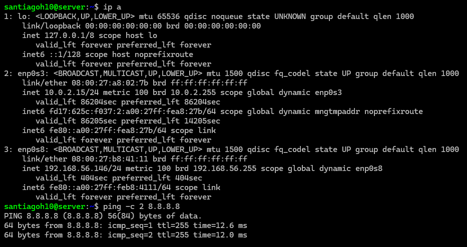 

### Resultado esperado

*   Interfaz NAT con IP del tipo `10.0.2.x`
*   Interfaz host-only con IP `192.168.56.146`

Este paso justifica las pruebas de entrada y salida que se realizan más adelante.

***

## FASE 1 – Comprobar el estado inicial del firewall

### Objetivo

Comprobar si el firewall UFW está activo antes de realizar configuraciones.

### Comando

```
sudo ufw status verbose
```

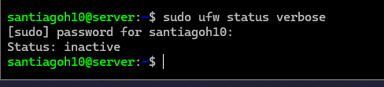 


### Resultado obtenido

    Status: inactive
    
### Explicación

El firewall se encuentra desactivado, lo cual es adecuado para comenzar la práctica desde un estado limpio.

***

## FASE 2 – Denegar tráfico de entrada por defecto y activar UFW

### Objetivo

Configurar el firewall para bloquear todo el tráfico entrante por defecto y activar UFW.

### Comandos

```
sudo ufw default deny incoming
```

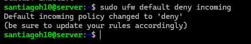 


Durante la activación se confirma la operación escribiendo `y`.

### Verificación

```
sudo ufw status verbose
```

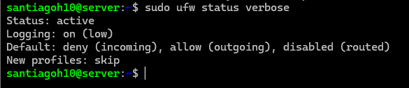 


### Resultado esperado

    Status: active
    Default: deny (incoming), allow (outgoing)

### Explicación

Se establece una política de seguridad básica: todo el tráfico entrante se bloquea salvo excepciones explícitas.

***

## FASE 3 – Comprobación del bloqueo de tráfico de entrada

### Objetivo

Demostrar que el tráfico entrante está bloqueado por defecto.

### Prueba

Desde el anfitrión (Windows o sistema host), ejecutar:

```
ping 192.168.56.146
```

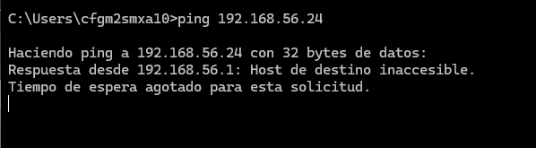 


### Resultado observado

El servidor no responde al ping (host inaccesible / tiempo de espera agotado).

### Explicación

Esto confirma que el firewall bloquea correctamente el tráfico entrante ICMP.

***

## FASE 4 – Denegar tráfico de salida por defecto

### Objetivo

Cambiar la política por defecto para bloquear todo el tráfico de salida y demostrar su efecto.

### Comandos

```
sudo ufw default deny outgoing
```

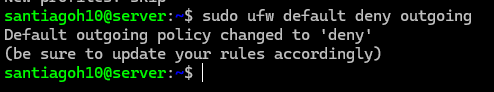 


### Verificación

```
sudo ufw status verbose
```

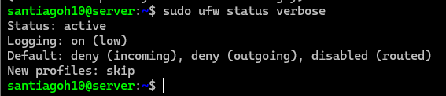 


Resultado esperado:

    Default: deny (incoming), deny (outgoing)

### Comprobación

```
ping -c 2 8.8.8.8
```

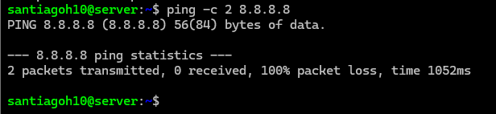 


### Resultado observado

    100% packet loss

### Explicación

El servidor pierde conectividad a Internet porque el tráfico saliente está bloqueado.

***

## FASE 5 – Permitir tráfico de salida por defecto

### Objetivo

Volver a permitir el tráfico de salida y comprobar la recuperación de conectividad.

### Comandos

```
sudo ufw default allow outgoing
sudo ufw status verbose
```

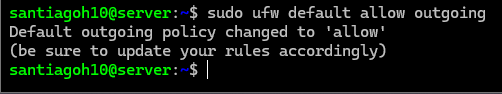 

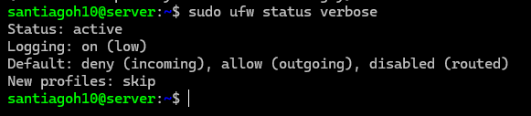 


Resultado esperado:

    Default: deny (incoming), allow (outgoing)

### Comprobación

```
ping -c 2 8.8.8.8
```

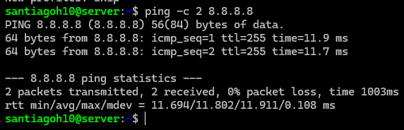 


### Resultado observado

El ping responde correctamente.

### Explicación

La conectividad exterior se restablece al permitir el tráfico de salida por defecto.

***

## FASE 6 – Bloquear el acceso a un dominio concreto

### Objetivo

Bloquear el acceso al dominio `capgros.elnacional.cat`.

### Obtención de direcciones IP del dominio

```
dig capgros.elnacional.cat +short
```
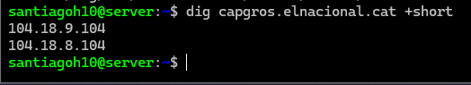 


Resultado obtenido:

    104.18.9.104
    104.18.8.104

### Creación de reglas de bloqueo

Se bloquean todas las IPs asociadas al dominio:

```
sudo ufw deny out to 104.18.9.104
sudo ufw deny out to 104.18.8.104
```

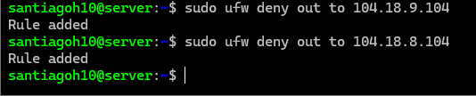 


### Comprobación

```
ping -c 2 capgros.elnacional.cat
```

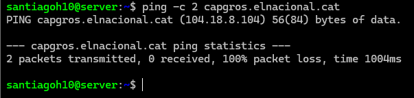 


### Resultado observado

    100% packet loss

### Explicación

El dominio queda inaccesible al bloquear todas sus direcciones IP.

***

## FASE 7 – Permitir acceso a nginx solo desde una IP concreta

### Objetivo

Permitir acceso HTTP al servidor únicamente desde la IP del anfitrión `192.168.56.1`.

### Instalación y comprobación de nginx

```
sudo apt update
sudo apt install nginx -y
sudo systemctl start nginx
sudo systemctl status nginx
```

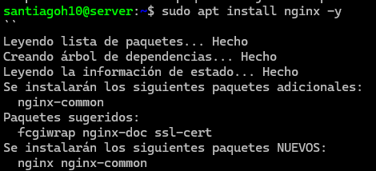 

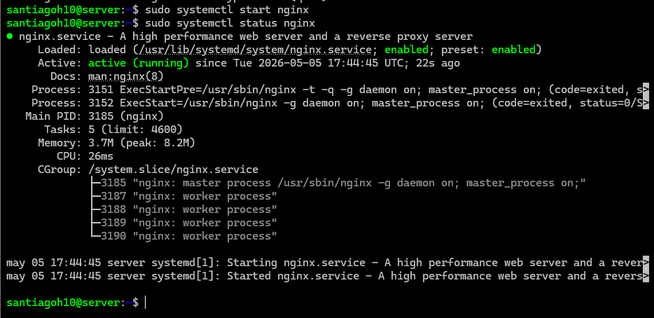 

Resultado esperado:

    Active: active (running)

### Creación de la regla UFW

```
sudo ufw allow from 192.168.56.1 to any port 80
```

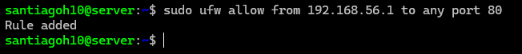 


### Comprobación

*   Desde el host, acceder en el navegador a:
        http://192.168.56.146
*   Aparece la página por defecto de nginx.

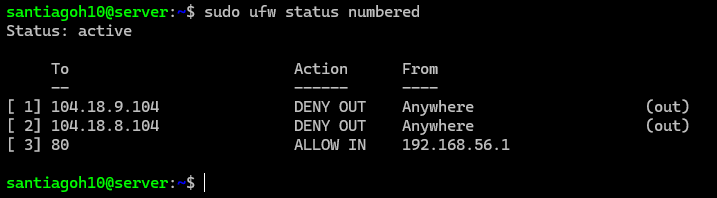 

### Explicación

El acceso HTTP queda restringido exclusivamente al anfitrión.

***

## FASE 8 – Mostrar la configuración final del firewall

### Objetivo

Mostrar todas las reglas activas del firewall como cierre de la práctica.

### Comando

```
sudo ufw status numbered
```

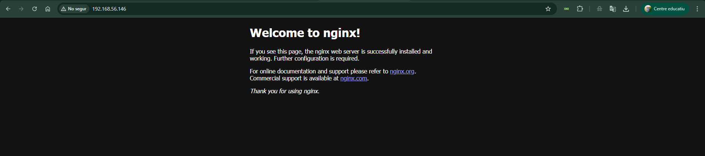 

### Resultado obtenido

    [ 1] 104.18.9.104 DENY OUT Anywhere
    [ 2] 104.18.8.104 DENY OUT Anywhere
    [ 3] 80 ALLOW IN 192.168.56.1

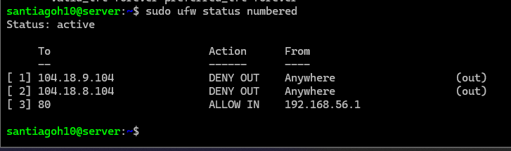 

### Explicación

Se verifica la configuración final del firewall, confirmando que cumple todos los requisitos establecidos en la práctica.

***

## Conclusión

Se ha configurado correctamente el firewall UFW aplicando políticas por defecto, reglas específicas de entrada y salida, bloqueo de dominios y control de acceso a un servicio web, comprobando cada paso mediante pruebas prácticas.

